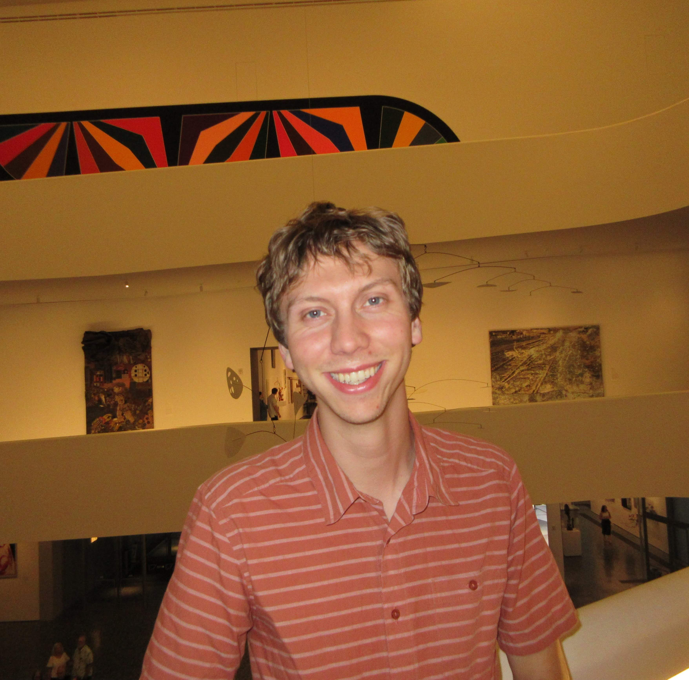

Welcome! I’m a cognitive psychologist and vision scientist interested in how people detect, attend to, and interact with visual information in complex environments.

My research combines **eye-tracking**, **reaction time modeling**, and **computational approaches** to understand how visual attention guides behavior.

Currently, I’m a Ph.D. student at **Texas A&M University**, working on projects exploring visual search.

Explore the site:

- 🧠 [About](/about/)
- 📄 [Publications](/publications/)
- 💻 [Projects](/projects/)
- � [Tester](/tester/)
- �📬 [Contact](/about/#contact)

---
